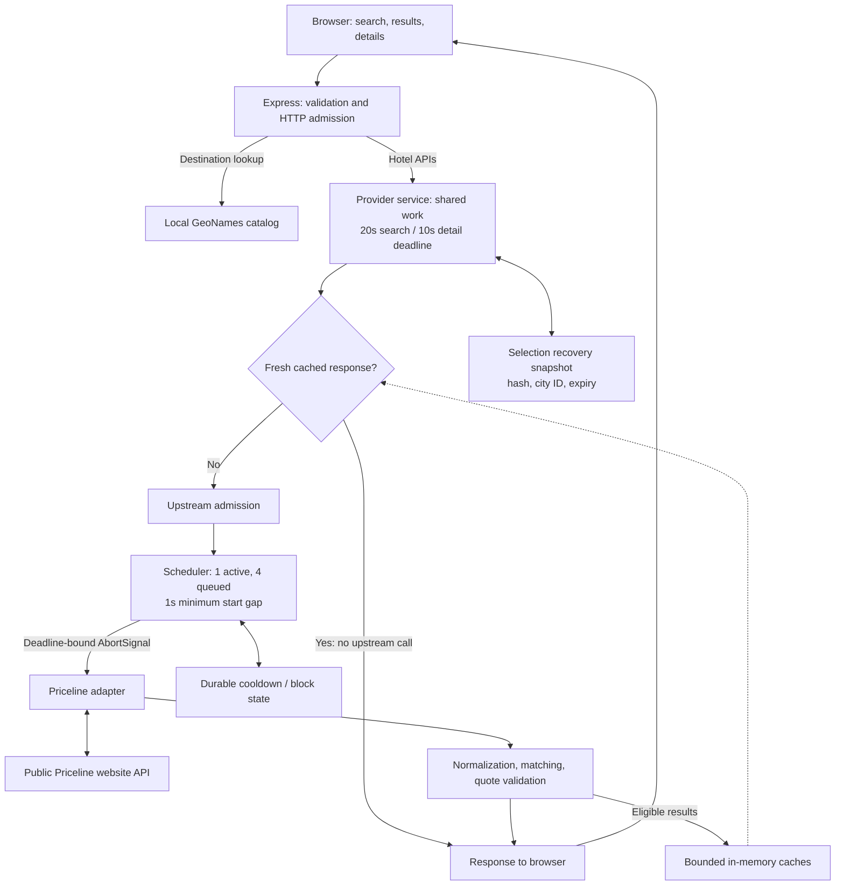

# Hotel Revealer

Explore Priceline Express deals before booking, with one inferred hotel when the
available clues support it. **Hotel identity is inferred, not verified.** The
original offer, its current price, and the hotel inference remain separate.

[Open Hotel Revealer](https://hotelrevealer.tech) · [Dated deployment evidence](docs/LIVE_DEPLOYMENT.md)


## Engineering highlights

- **Conflicting evidence stays unknown.** Duplicate observations cannot restore a
  matching fact previously invalidated by a conflict. Raw matching values remain
  separate from display normalization. See [normalization](backend/domain/normalization.ts)
  and [matching rules](backend/domain/matching.ts).
- **Provider work has explicit limits.** Admission, request sharing, a bounded
  queue, deadlines, and persisted cooldowns coordinate one upstream call at a time.
  Cache hits and shared followers avoid new upstream work. See the
  [service](backend/provider/service.ts) and [operating contract](backend/provider/README.md#budgets-caches-and-state).
- **Restart recovery preserves the original offer.** A bounded snapshot stores an
  exact trip/offer hash, optional provider city ID, and expiry. It can fetch a fresh
  original-offer quote and rebuild its handoff without reviving saved prices or a hotel inference.
  See the [selection store](backend/provider/selection-store.ts).
- **Checks preserve independent evidence.** Differential tests retain the original
  matching implementation as a reference. Diagnostics allow only shipped source
  locations and controlled categories, excluding raw provider errors and trip data.
  See the [matching study](scripts/matching-study/README.md) and [diagnostics](backend/diagnostics.ts).

## Architecture

React and Redux provide the traveler workflow. One Express process serves the
production build, local destination lookup, and hotel APIs. Application code and
automated tests use TypeScript, with [shared contracts](shared/contracts.ts) for
trip data and responses. Node 24 runs the backend with native type stripping;
Vite builds browser TSX. Strict type checking is a separate CI gate. Types erase
at runtime, so input, provider-response, and request-identity validation remain.



A disconnected caller does not cancel shared work needed by another caller.
Admission remains held until pending work settles. Destination lookup makes no
provider request. The checksummed GeoNames catalog is vendored for reproducible,
offline startup and stays on the server; see [data provenance and refresh](docs/DATA_SOURCES.md).

## Run locally

Use Node **24.20.0** from `.nvmrc` and npm **11.19.0** with the root workspace lockfile.

```sh
nvm install
nvm use
npm ci
npm run dev
```

Open `http://127.0.0.1:5173`; the frontend proxies `/api` to Express on port 5000.
The development command watches both frontend and backend source. Use
`PORT=5001 npm run dev` if port 5000 is occupied. Root `.env` values also apply;
see [.env.example](.env.example).

Normal startup uses the public Priceline adapter. No provider credential was
required in the recorded local flow. For offline development, use
`HOTEL_PROVIDER=disabled npm run dev`; destination lookup and the interface remain
available, while hotel requests report that the provider is not configured.

To serve the production build:

```sh
npm run build
NODE_ENV=production npm start
```

Open `http://127.0.0.1:5000`. `/health` checks application readiness, including
required production HTML, without calling the provider. It does not prove live
hotel search works.

## Verify

```sh
npm run check
npx playwright install chromium firefox webkit
npm run test:browser
```

`check` runs strict type checking, ESLint, native tests, and the production build.
Use `npm run typecheck` for the server, browser, and test configurations alone.
Browser tests use that build and intercept their own API requests with synthetic
fixtures; the production server has no fixture or demo endpoint. CI disables the
live provider.

The [acceptance record](docs/ACCEPTANCE.md) binds results to tested revisions and
distinguishes native tests, browser scenarios, live observations, and unresolved
gates. The TypeScript checkpoint passed 291 native tests and 436 browser
executions, plus local development and production-only runtime checks. A clean
install reproduced the browser-tested build byte-for-byte. Later CI and hosted
Docker execution are recorded in [deployment evidence](docs/LIVE_DEPLOYMENT.md).
Browser configurations cover Chromium, mobile Chromium emulation, Firefox,
and WebKit; they do not establish physical-device or manual accessibility support.
Generated evidence stays in ignored `output/`, `test-results/`, and `playwright-report/`.

## Limits and evidence

- **Matching accuracy is unverified.** A unique inferred hotel is not an established
  identity. Missing facts stay unknown, price cannot establish identity, and
  retrieved pagination is not exhaustive provider inventory. Final booking terms
  and totals must be checked with the provider.
- **Live compatibility is a separate gate.** Local observations are recorded in
  [live integration evidence](docs/LIVE_ACCESS.md), and the public search, details,
  and handoff journey is recorded in [deployment evidence](docs/LIVE_DEPLOYMENT.md).
  They do not establish future compatibility or permission for public use.
- **Operate one application process.** Queue, cache, request, and payload limits
  are application safeguards, not measured hosting capacity or provider allowances.
  Review an interrupted call or block before using the
  [stopped-process reset procedure](deploy/README.md#reset-a-reviewed-provider-block).
- **Hosting is live; remaining gates stay explicit.** Public HTTPS, the hosted
  traveler journey, restart/reboot recovery, and failure-email delivery are
  recorded in [deployment evidence](docs/LIVE_DEPLOYMENT.md), including the actual
  rollback drill and its temporary public 503. A private off-host recovery archive
  passed isolated extraction; full-machine restoration remains untested.
  Real devices, manual assistive technology, known hotel outcomes, and first-time
  user sessions require their own evidence.

Use the [documentation index](docs/README.md) for API contracts, dependency decisions,
data attribution, deployment preparation, and detailed verification history.
