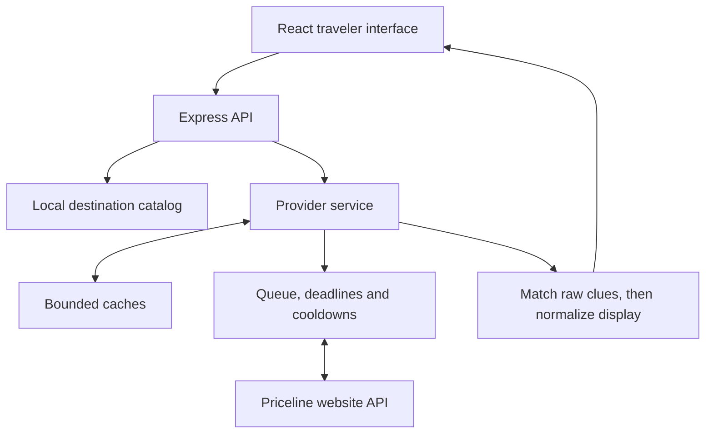

# Hotel Revealer

Explore the likely hotel behind a Priceline Express Deal before you book.

[Visit Hotel Revealer](https://hotelrevealer.tech) · [Source][source] · [Technical documentation][docs] · [Verified build][verified-build]

Priceline Express Deals hide the hotel name until booking. Hotel Revealer compares
the offer's available clues with named hotel listings, shows one inferred hotel
when the matching rules resolve it, and lets you inspect the property before
continuing to the original offer on Priceline.

**Hotel identity is inferred, not verified.** Unresolved deals stay unidentified;
the original offer, the inferred hotel, and the current price are separate facts.


## What you can do

1. **Plan a stay.** Find a destination by city or country, choose dates, and set
   rooms, adults, and children's ages. Request provider prices in USD, EUR, GBP,
   CAD, or AUD.
2. **Compare resolved deals.** Browse offers with one inferred hotel and sort by
   room rate, guest rating, star rating, or advertised discount. Offers without a
   single inferred hotel are excluded from the result list.
3. **Look into the property.** Inspect available photos, amenities, address, guest
   ratings, and review counts, with links to maps and external reviews.
4. **Check the original offer.** Request its total price, refresh an expired quote,
   and continue to Priceline with the selected offer and trip details. Booking and
   payment happen on Priceline.

The interface supports light and dark themes, responsive layouts, and returning
from hotel details to the previous result list and scroll position. Currency
changes request new provider prices rather than applying a browser-side conversion.

## How it is built

| Layer | Implementation |
| --- | --- |
| Interface | React 19, Redux, React Router, TypeScript, Vite, CSS |
| Server | Node.js 24, Express 5, TypeScript with native type stripping |
| Contracts | Shared TypeScript types plus runtime validation at request and provider boundaries |
| Destination lookup | Vendored GeoNames catalog, searched locally on the server |
| State | Bounded in-memory caches; small disk snapshots for provider control state and selection recovery |
| Verification | TypeScript, ESLint, Node's test runner, Playwright, axe accessibility checks |
| Deployment | One application container behind Caddy HTTPS; Docker Compose and GitHub Actions |



One Express process serves both the production frontend and the API. Destination
autocomplete does not contact Priceline. The rebuilt application does not require
MongoDB, a Google Maps API key, or a background job service.

### Engineering decisions

- **Preserve uncertainty.** Deterministic matching retains the original comparison
  rules while bounding work by neighborhood and star-rating groups. Conflicting,
  missing, ambiguous, or incomplete evidence remains unresolved. Differential
  tests compare behavior with the preserved original matcher; they do not measure
  real-world identification accuracy. See the [matching study][matching].
- **Bound upstream work.** The provider service shares concurrent requests,
  caches eligible responses, and limits queued work. Calls run one at a time with
  deadlines and persisted cooldown/block state. These controls constrain load;
  they are not provider-approved quotas. See the [provider contract][provider].
- **Recover a selection without reviving stale claims.** A short-lived recovery
  snapshot stores the trip/offer hash, optional provider city ID, and expiry.
  After a restart it can recover a fresh original-offer quote and handoff without
  restoring a saved price or an inferred hotel identity. See the
  [selection store][selection-store].

## Run locally

Use **Node.js 24.20.0** and **npm 11.19.0**, as pinned by `.nvmrc` and
`package.json`. Install from the root workspace lockfile.

```sh
git clone https://github.com/NadavsSchwartz/hotel-revealer.git
cd hotel-revealer
nvm install
nvm use
npm install --global npm@11.19.0
npm ci
npm run dev
```

Open [localhost:5173](http://127.0.0.1:5173). Vite proxies `/api` to Express on
port 5000; both processes watch source changes. If that port is occupied, run
`PORT=5001 npm run dev` instead.

The default adapter uses Priceline's public website API; recorded integration
checks did not require provider credentials. Live access depends on upstream
availability and compatibility. Optional root `.env` settings are documented in
[`.env.example`][env].

For offline interface work:

```sh
HOTEL_PROVIDER=disabled npm run dev
```

Destination lookup and the interface remain available. Hotel requests return a
provider-not-configured response; this mode does not supply demo search results.

To serve the production build locally:

```sh
npm run build
NODE_ENV=production npm start
```

Open [localhost:5000](http://127.0.0.1:5000). `/health` reports application and
recorded provider state without issuing a new upstream search.

## Verify changes

```sh
HOTEL_PROVIDER=disabled npm run check
npx --no-install playwright install chromium firefox webkit
HOTEL_PROVIDER=disabled npm run test:browser
```

`check` runs strict type checking, lint, native tests, and a production build.
Browser tests run against that build with intercepted API fixtures across
Chromium, mobile Chromium emulation, Firefox, and WebKit. Tests cover search,
navigation, pricing expiry, selection recovery, provider failure states, and
accessibility checks without depending on live inventory.

The [verified CI run][verified-build] for
[`58f9c1f`](https://github.com/NadavsSchwartz/hotel-revealer/commit/58f9c1fe4bfb42fa58a908493990830c3f36a536)
passed the checks, browser suite, deployment-script validation, and production
container smoke test, then published the tested image. This is evidence for that
revision. The [acceptance record][acceptance] contains detailed local checkpoints
and remaining validation gaps. The [live deployment record](docs/LIVE_DEPLOYMENT.md)
separately documents the released image, hosted journey, reboot, and rollback checks.

## Scope and limitations

- **No guaranteed identity or savings.** Matching agreement is evidence for an
  inference, including when only one hotel fits. It is not verified hotel identity.
  Advertised discounts describe the room rate, not guaranteed total savings.
- **Prices and availability can change.** Quotes expire. Confirm the final hotel
  disclosure, room, total, cancellation policy, and booking terms on Priceline.
- **Provider access can fail.** The integration uses a public website API, not an
  official partner API. Successful requests do not establish permission for
  automated use or future compatibility; see [live access and constraints][live-access].
- **Coverage is bounded.** A worldwide destination catalog does not imply hotel
  inventory for every location. Search pagination is limited, and partial results
  are not treated as exhaustive inventory.
- **Operational proof has limits.** The application is designed for one process.
  Automated checks and a reachable site do not establish production capacity,
  identification accuracy, physical-device support, or manual accessibility.

## Documentation and contributions

- [Documentation index][docs] — API behavior, data provenance, dependencies, and verification records.
- [Implementation contract][implementation] — matching, pricing, response validation, and recovery.
- [Data sources and attribution][data] — destination data, refresh procedure, and media credits.
- [Deployment guide][deployment] — container packaging, VPS configuration, health checks, and rollback.

For bugs, include reproduction steps, browser/device, and the visible error; omit
credentials and personal booking information. Keep pull requests focused and run
the relevant checks. Target `main` for application changes.

## License

The app is available as open source under the terms of the
[MIT License](https://opensource.org/licenses/MIT). Third-party data, fonts, and
media retain their own licenses; see [data sources and attribution][data].

[source]: https://github.com/NadavsSchwartz/hotel-revealer/tree/main
[docs]: docs/README.md
[matching]: scripts/matching-study/README.md
[provider]: backend/provider/README.md
[selection-store]: backend/provider/selection-store.ts
[env]: .env.example
[acceptance]: docs/ACCEPTANCE.md
[live-access]: docs/LIVE_ACCESS.md
[implementation]: docs/IMPLEMENTATION.md
[data]: docs/DATA_SOURCES.md
[deployment]: deploy/README.md
[verified-build]: https://github.com/NadavsSchwartz/hotel-revealer/actions/runs/34405371862
