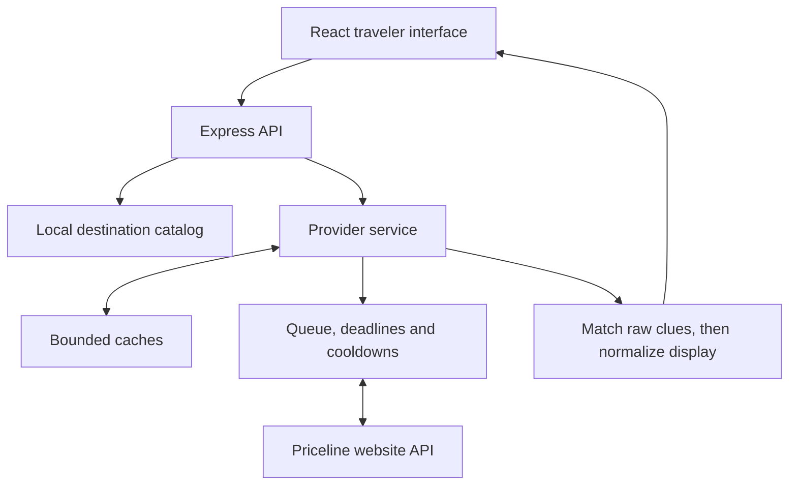

# Hotel Revealer

Matches Priceline Express Deals to named hotels using star ratings, neighborhoods,
amenities, guest ratings, review counts, and rates.

The hotel name is inferred by deterministic rules, not confirmed. Only deals with
one consistent match appear in results. Prices and availability come from
Priceline's unofficial website API and can change or become unavailable.

[Live site](https://hotelrevealer.tech) · [Docs](docs/README.md)


## Features

- Destination autocomplete and search by dates, rooms, adults, and children's ages.
- Prices in USD, EUR, GBP, CAD, and AUD.
- Sorting by room rate, guest rating, stars, or advertised room-rate discount.
- Hotel photos, amenities, address, ratings, and links to maps and reviews.
- Original-offer totals, quote refresh, and a Priceline handoff with the selected trip.

## Architecture

| Layer | Implementation |
| --- | --- |
| Interface | React 19, Redux, React Router, TypeScript, Vite, CSS |
| Server | Node.js 24, Express 5, native TypeScript stripping |
| Validation | Shared TypeScript contracts and runtime checks on external data |
| Destination lookup | Local GeoNames catalog |
| State | Bounded memory caches and local state files |
| Tests | Node's test runner, Playwright, axe |
| Deployment | One application container, Caddy, Docker Compose, GitHub Actions |



Express serves the frontend and API. Destination lookup runs locally.
No database or Google Maps API key is required.

### Constraints

- Run one application process. Caches and upstream scheduling are not shared across replicas.
- Upstream calls are queued, rate-limited, and cached. Provider access restrictions still apply.
- Search pagination is bounded; results are not exhaustive inventory.
- Confirm the final room, total price, and booking terms on Priceline.

## Run locally

Requires **Node.js 24.20.0** and **npm 11.19.0**. Use the root workspace lockfile.

```sh
git clone https://github.com/NadavsSchwartz/hotel-revealer.git
cd hotel-revealer
nvm install
nvm use
npm install --global npm@11.19.0
npm ci
npm run dev
```

Open [localhost:5173](http://127.0.0.1:5173). Vite proxies `/api` to Express on
port 5000. Both processes watch source changes. If port 5000 is occupied, use
`PORT=5001 npm run dev`.

Priceline is the default provider. Optional settings are in [.env.example](.env.example).

For offline interface work:

```sh
HOTEL_PROVIDER=disabled npm run dev
```

Destination lookup works offline. Hotel requests return a provider-not-configured
response; there are no demo search results.

To serve the production build:

```sh
npm run build
NODE_ENV=production npm start
```

Open [localhost:5000](http://127.0.0.1:5000). `/health` reports application and
recorded provider state without making an upstream request.

## Verify

```sh
HOTEL_PROVIDER=disabled npm run check
npx --no-install playwright install chromium firefox webkit
HOTEL_PROVIDER=disabled npm run test:browser
```

`check` runs strict type checking, lint, native tests, and the production build.
Browser tests use that build with synthetic API responses across Chromium, mobile
Chromium, Firefox, and WebKit. They cover search, navigation, quote expiry,
recovery, provider errors, and automated accessibility checks.

[CI at `f5f6358`](https://github.com/NadavsSchwartz/hotel-revealer/actions/runs/34415402534):
291 native tests, 452 browser tests, and production container checks passed.

## Docs and contributing

- [Documentation index](docs/README.md)
- [Implementation](docs/IMPLEMENTATION.md) — API contracts, pricing, and recovery.
- [Matching rules](scripts/matching-study/README.md) — original predicates and differential tests.
- [Provider boundary](backend/provider/README.md) — queues, caching, deadlines, and persisted state.
- [Live access](docs/LIVE_ACCESS.md) — integration behavior and provider restrictions.
- [Deployment](deploy/README.md) · [Live deployment record](docs/LIVE_DEPLOYMENT.md) · [Verification history](docs/ACCEPTANCE.md)
- [Data sources and attribution](docs/DATA_SOURCES.md)

Keep PRs focused, target `main`, and run the relevant checks. Bug reports should
include reproduction steps, browser/device, and the visible error. Leave out
credentials and personal booking information.

## License

[MIT](https://opensource.org/licenses/MIT). Third-party data, fonts, and media
retain their own licenses; see [attribution](docs/DATA_SOURCES.md).
